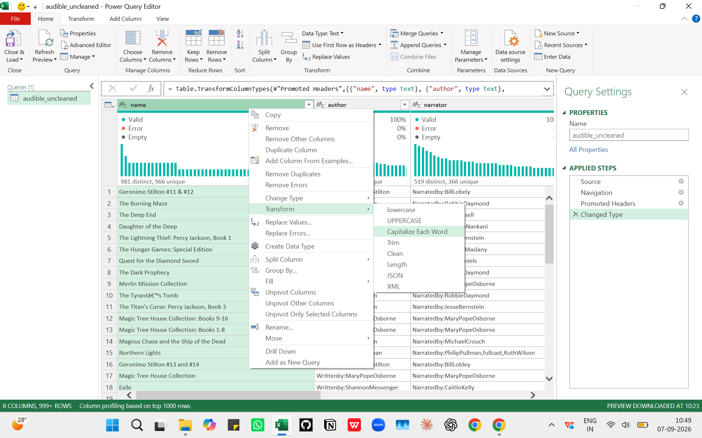
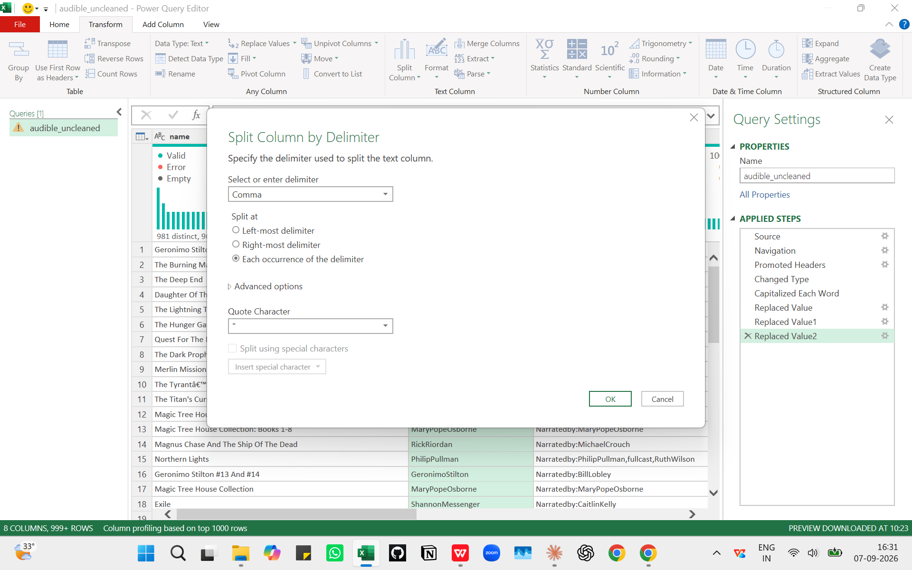
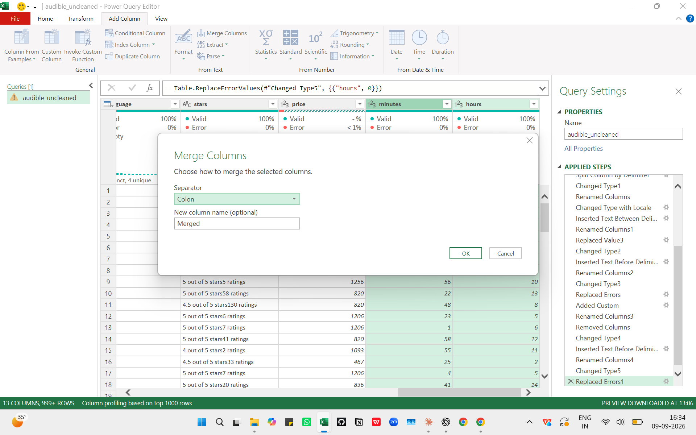

# 🎧 Audible Data Cleaning Project

**Cleaning & Standardizing an Audible Audiobook Dataset Using Excel Power Query** ⚡

---

## 📌 Table of Contents

- [🎯 Project Overview](#-project-overview)
- [🛠️ Tools & Techniques Used](#️-tools--techniques-used)
- [📋 The 9 Cleaning Tasks](#-the-9-cleaning-tasks)
- [🔍 Task-by-Task Breakdown](#-task-by-task-breakdown)
- [📈 Key Results](#-key-results)
- [📸 Screenshots](#-screenshots)
- [💡 Key Learnings](#-key-learnings)
- [👤 Author](#-author)

---

## 🎯 Project Overview

Audible's raw dataset was **messy and unstructured** — inconsistent text casing, combined author/narrator names, text-based durations, bundled ratings, and even non-numeric prices. 📊

This project uses **Power Query Editor in Excel** to clean, standardize, and transform the raw data into a fully **analysis-ready dataset** through **9 structured tasks**.

📂 **Dataset:** 999+ rows of audiobook data
🏁 **Outcome:** Fully cleaned, structured dataset ready for analysis

---

## 🛠️ Tools & Techniques Used

| Tool / Technique | Purpose |
|---|---|
| 🟩 **Microsoft Excel** | Data source & final output |
| ⚡ **Power Query Editor** | All transformations & ETL steps |
| 🔤 **Capitalize Each Word** | Standardizing text casing |
| ✂️ **Split Column by Delimiter** | Separating combined names |
| 🧹 **Replace Values / Replace Errors** | Fixing bad & non-numeric values |
| 🔗 **Merge Columns** | Combining fields (date + language) |
| 🔢 **Data Type Conversion** | Text → Number, Date, Duration, Currency |

---

## 📋 The 9 Cleaning Tasks

| # | Task | What Was Done |
|---|---|---|
| 1️⃣ | **Name Casing** | Standardized book titles to title case |
| 2️⃣ | **Author Split** | Separated combined authors into columns |
| 3️⃣ | **Release Date** | Verified consistent DD-MM-YYYY format |
| 4️⃣ | **Time Duration** | Converted text → Excel Duration type |
| 5️⃣ | **Price Numeric** | Fixed non-numeric price values |
| 6️⃣ | **Star Ratings** | Extracted star score & rating counts |
| 7️⃣ | **Narrator Split** | Cleaned & split combined narrators |
| 8️⃣ | **Release Info** | Merged date + language into one field |
| 9️⃣ | **Price Format** | Formatted prices to 2-decimal currency |

---

## 🔍 Task-by-Task Breakdown

### 1️⃣ Name Casing 🔤
The `name` column mixed sentence case, ALL CAPS, and inconsistent styling.
- ✅ Applied **Capitalize Each Word** to standardize all **981 titles**
- 🛠️ Fixed apostrophe artifacts with **Replace Values**: `'S → 's` (e.g., *Titan'S → Titan's*)
- 🏆 **966 unique titles** now in clean, consistent title case

### 2️⃣ Author Split ✂️
The `author` field carried a `"Writtenby:"` prefix with comma-separated names.
- 🧹 **Replace Values**: removed the `"Writtenby:"` prefix
- ✂️ **Split Column by Delimiter** (comma) — twice — for books with **3+ co-authors**
- 🏆 **16 distinct combinations** separated fully into individual author columns

### 3️⃣ Release Date 📅
- ✅ No correction needed! Column verified with **100% valid values, 0% errors**
- 📊 **238 unique dates** already in consistent **DD-MM-YYYY** format out of 410 distinct raw entries

### 4️⃣ Time Duration ⏱️
Raw `time` was text like *"10 hrs and 56 mins"*.
- 🔍 **Text Before Delimiter** ("hr") → extracted hours
- 🔍 **Text Between Delimiters** ("and" → "min") → extracted minutes
- ➕ **Custom Column** reconciled both minute-extraction passes into one accurate value
- 🧯 **Replace Errors: 0** → fixed the **31% error rate** in the hours column
- 🔗 **Merge Columns** (colon separator) → combined hours + minutes
- 🔢 Converted to true **Duration data type** — text became something Excel can calculate with!

### 5️⃣ Price Numeric 💰
- ⚠️ Converting `price` to numeric surfaced **exactly 1 non-numeric value** out of 1000 rows
- 🧯 **Replace Errors: 0** resolved it — column is now fully numeric

### 6️⃣ Star Ratings ⭐
Raw `stars` text bundled two numbers: *"5 out of 5 stars34 ratings"*.
- 🔍 **Text Before Delimiter** ("out") → extracted the star score (e.g., `5`)
- 🧯 **Replace Errors: 0** on the ratings-count column → cleared a **76% error rate**
- 🏆 Both star score & rating count now numeric

### 7️⃣ Narrator Split 🎙️
Same issues as the author column.
- 🧹 **Replace Values**: removed the `"Narratedby:"` prefix
- 🔤 **Capitalize Each Word** applied *before* splitting (while still one combined field)
- ✂️ **Split Column by Delimiter** — same method as authors
- 🏆 **366 unique narrators** identified among 519 distinct raw entries

### 8️⃣ Release Info Merge 🔗
- 🔤 **Capitalize Each Word** on the `language` column
- 🔗 **Merge Columns**: `releasedate` + `language`, separator `", "` → renamed to **`release info`**
- 🏆 Values like `04-08-2008, English` — **355 unique combinations** across 551 distinct entries

### 9️⃣ Price Format 💵
- 🔢 Changed data type from Whole Number → **Currency**
- ✅ Every price now displays consistently with two decimals: `468 → 468.00`, `820 → 820.00`
- 🏆 **60 unique price points** across 158 distinct values

---

## 📈 Key Results

| Metric | Result |
|---|---|
| 🧹 **Rows Cleaned** | 999+ |
| 🔤 **Unique Titles Standardized** | 966 |
| 🎙️ **Unique Narrators Identified** | 366 |
| 🔗 **Release Info Combos** | 355 |
| 🛠️ **Tasks Completed** | 9 / 9 ✅ |
| ⚠️ **Error Rates Resolved** | 31% (hours) · 76% (ratings) |

---

## 📸 Screenshots

### 🔤 Before → After: Name Casing

### ✂️ Splitting Combined Authors

### ⏱️ Building the Duration Column

---

## 💡 Key Learnings

- 🧹 **Data cleaning is 80% of real-world analytics work** — raw data is never analysis-ready
- ⚡ **Power Query makes ETL reproducible** — every step is recorded and refreshable
- 🧯 **Replace Errors** is a lifesaver for columns with mixed types (text + numbers)
- 🔤 Always apply **text casing fixes BEFORE splitting columns** — it saves rework
- 📅 Not every column needs fixing — **verify before you transform** (release date was already clean!)

---

## 👤 Author

**Rohit Nair** 👋
🎓 Aspiring Data Analyst | Excel · Power Query · Data Cleaning

- 🔗 [LinkedIn](https://www.linkedin.com/in/rohit-nair)
- 🐙 [GitHub](https://github.com/rohitnair-ba)
- ✉️ rohit.nair995@gmail.com

---

⭐ *If you found this project helpful, please give it a star!* ⭐
